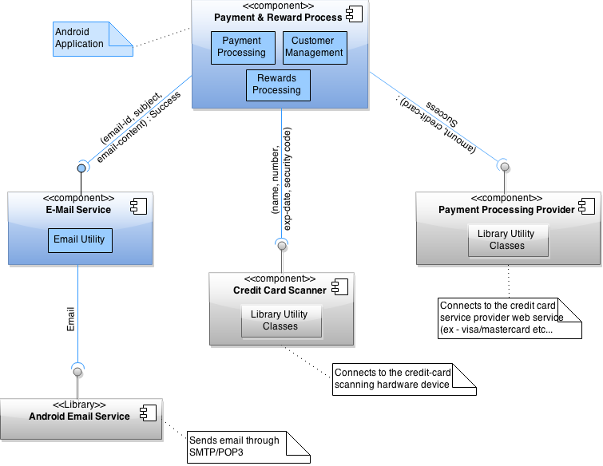
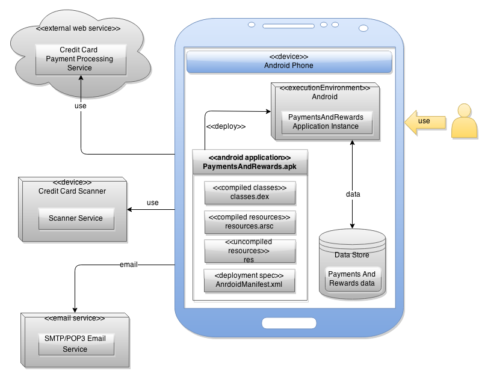
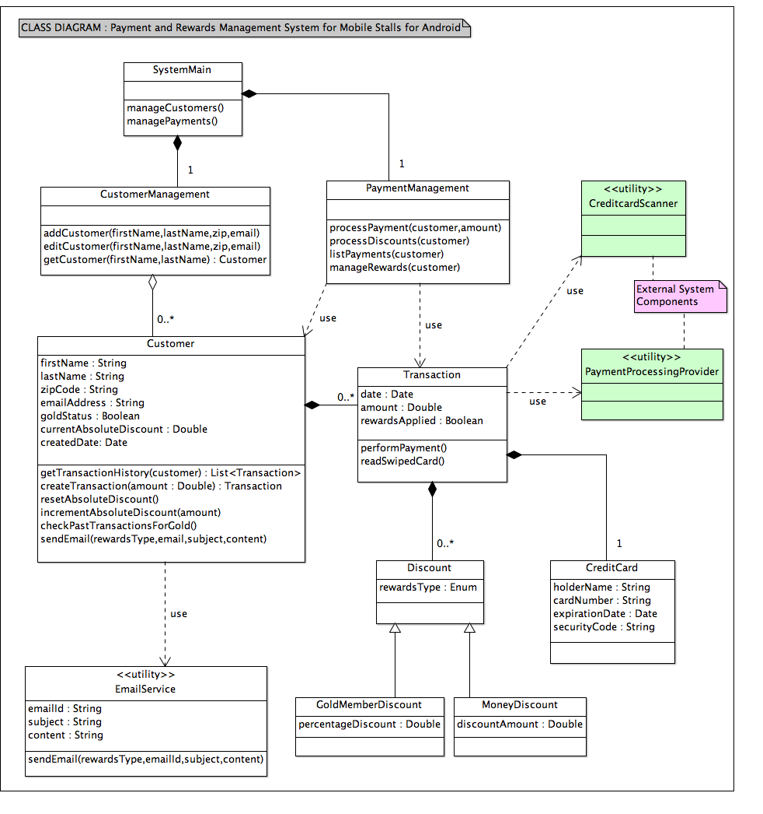

# Design Document

This document describes the architecture and design of the 'Payment and Rewards Management System for Mobile Stalls 
for Android' (PReMS) by capturing the details through UML diagrams such as component, deployment and class diagrams.

The document also captures the design constraints and assumptions.

**Author**: **Team26**

## 1 Design Considerations

### 1.1 Assumptions

- It is assumed that the stall manager has an Android device to use the PReMS application
- Assumption is that the stall manager user is familiar with the Android OS and in using Android apps
- It is assumed that the user is aware of the complete set of requirements
- Library classes such as Date or Currency  are not shown in the design. More preference is given to the usage
of standard Java library classes instead of custom implementations
- This design document does not document the screenshots used. If time permits, they will be captured as part of 
user manual documentation
- No automated test cases are implemented or code coverage is checked. Manual testing is conducted and only if
time permits, automated testing is planned

### 1.2 Constraints

- This system is only supported for Android phones/tablets and the user interface is optimized for Android phones
- The credit card scanner service and payment processing service (both external components) are assumed to be available
to the system. And hence these are not explicitly implemented. A external library is planned to be used here
- The email functionality is not fully implemented/tested in the first iteration of the application. Only a stub
is implemented and if time permits, email functionality is integrated
- The credit card information is not stored for each user explicitly. As and when a transaction is processed, the 
credit card details are associated for that transaction are stored

### 1.3 System Environment

- Eclipse IDE with an android simulator/android device is used to develop and test the application
- Eclipse Kepler or above is used for application development and JDK 1.6 or above is used
- The Payment and Rewards Management Android application is targeted for Android API versions between 16 and 19
- Android libraries that are installed on top of Eclipse are used for application development

## 2 Architectural Design

The architecture provides a high-level design view of the system and the detailed design provides the component details
and their interactions.

### 2.1 Component Diagram

A high level application component diagram is given below that shows the various application components, their interfaces
and the interaction between them.

The complexities regarding `E-Mail service`, `Credit card scanner` and `Payment-Processing Provider` services are 
hidden as they are not explicitly implemented in this system. 

### 2.2 Deployment Diagram

A deployment diagram that indicates the deployment location of the various application components, packages & libraries
is shown below. It also describes the external services and devices used.

## 3 Low-Level Design

The main components associated with the application are described below

- Customer, Transaction and Reward classes
	- A class diagram is specified in section 3.1 that describes the individual entities, attributes, method and their
	relationships
- E-Mail service
	- The email service utility class is used to encapsulate the functionality of sending emails. It typically uses
	the Android email utility library functions to send emails
	- The actual sending of emails is an optional implementation and for the initial version, only a stub is provided
	- The attributes needed for sending an email includes `email-id`, `subject` and `email-content`
- Credit Card Scanner service
	- This component is not elaborated and it is assumed that a library or external device/service is available that 
	performs the scanning of the credit card
	- The external service returns the `card holder name`, `credit card number`, `expiration date` and `security
	code` after scanning the credit card
- Payment Processing Provider service
	- This component is also not elaborated and it assumed that a library or external service is available
	- This service processes the payment on the credit card for the specified amount and returns a TRUE or FALSE
	based on the success/failure of completing the credit card transaction. If successful, the exact time of the 
	transaction is returned and if failure, an error code/error message is returned to the calling method
- Note : Data architecture (E-R diagrams, SQL Lite details) is not described in detail. The Android data store is
used to stored the customer and rewards information captured within the application

### 3.1 Class Diagram

The class diagram for the payment and rewards management system is given below. Note that this diagram only captures the
main entities that relate to the requirements. i.e. Customers, Payments and Rewards. Implementation level classes like 
the Android library classes, config classes and entities are not captured in this diagram. This diagram will be updated
as and when the application is implemented to keep it up to date.

- The `CustomerManagement` and `PaymentManagement` classes are implemented to separate the complex functionalities (separation
of concern)
- A `Discount` base class is implemented so that there is scope for additional type of discounts to be added in future.
Currently only the absolute discount and gold member discounts are available
- The processed discounts are tied to transactions
- The implementation level attributes (for example lists) are not shown in the class diagram