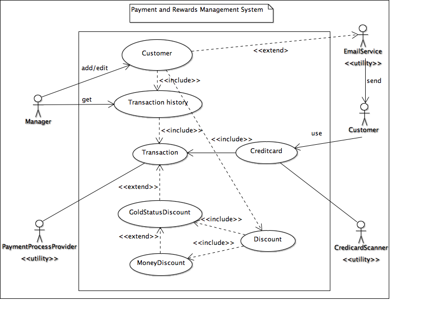

# Use Case Model

**Author**: **Team26**

## 1 Use Case Diagram

A use case diagram is given below that shows the various actors, use cases and the interaction between them.

## 2 Use Case Descriptions

Use case descriptions are given below that describe each use case' requirements, pre-conditions, post-conditions, and scenarios.

### 2.1 UC1: ADD CUSTOMER

- Requirements: This use case allows the stall manager to add a new customer

- Pre-conditions: The application is running. Customer provided his/her personal information

- Post-conditions: Customer information is added

- Scenarios: Stall manager gets the customer information. Stall manager adds customer to application and saves 
the information to the data store

### 2.2 UC2: EDIT CUSTOMER

- Requirements: This use case allows the stall manager to edit a customer's account information

- Pre-conditions: The application is running. The customer information is already loaded and available

- Post-conditions: The customer information is updated and stored back in the data store

- Scenarios: Stall manager looks up customer information, selects the customer, edits information, and saves to
the data store 

### 2.3 UC3: GET TRANSACTION HISTORY

- Requirements: This use case allows the stall manager to view any customer's transaction history

- Pre-conditions: The application is running. The customer is not new. The customer information is
already loaded and available

- Post-conditions: The transaction history for the customer is displayed on the user interface

- Scenarios: Stall manager selects a customer and clicks transaction history option; The system displays a list of 
purchases with details (date, amount, whether discounts were applied and which ones)

### 2.4 UC4: SEND DOLLAR REWARD EMAIL

- Requirements: In this use case, the system sends email to customers for 10 dollars rewards

- Pre-conditions: The customer's information is in the data store. System is connected with an email service software.
A new transaction is conducted which is worth $100 or more

- Post-conditions: Email is sent to the customer. The $10 dollar reward is added in the customer's account for future 
purchases

- Scenarios: Customer spent $100 or more in a single purchase. Then the customer gets a $10 discount towards a future
purchase as a reward. System sends an email to the customer

### 2.6 UC6: SEND GOLD STATUS EMAIL

- Requirements: In this use case, the system sends email to a customer who reaches gold status

- Pre-conditions: The customer's information is in the data store. The customer's total purchase in a calendar years is
greater than or equal to $1000. System is connected with an email service software

- Post-conditions: The customer's status updates to "Gold". System sends an email to the customer. The customer will get
a 5% discount on every future purchase

- Scenarios: Customers who spend $1000 or more in a calendar year achieve "gold" status, which entitles them to a 5%
discount for life and on every future purchase. The change of status is effective immediately after reaching the specified
threshold

### 2.7 UC7: PERFORM TRANSACTION WITHOUT DISCOUNT

- Requirements: In this use case, system performs a transaction without discount

- Pre-conditions: Customer bought products. The customer is not in gold status. The customer has no money discount in his
account. System is connected with credit-card scanning and payment processing software 

- Post-conditions: System processes the transaction. Transaction history is updated. The customer's calendar purchase
is updated.
 
- Scenarios: Customer scans his/her credit card, and payment is completed without any discount.

### 2.8 UC8: PERFORM TRANSACTION WITH 5% DISCOUNT

- Requirements: In this use case, system performs a transaction with 5% discount

- Pre-conditions: Customer buys products. The customer's status is gold. System is connected with credit-card scanning
and payment processing softwares

- Post-conditions: The 5% discount is applied in the final transaction. Transaction history is updated. The customer's
calendar purchase is updated

- Scenarios: Gold customer scans his/her credit card, and payment is completed with 5% discount

### 2.9 UC9: PERFORM TRANSACTION WITH MONEY DISCOUNT

- Requirements: In this use case, system performs a transaction by applying the absolute money discount available for 
the customer

- Pre-conditions: Customer buys products. The customer's status is not gold. The customer has money reward in his/her
account. System is connected with credit-card scanning and payment processing software

- Post-conditions: Money discount is applied in final transaction. Transaction history is updated. The customer's
calendar purchase is updated. Money discount balance is updated

- Scenarios: Customer scans his/her credit card, and payment is completed with money discount

### 2.10 UC10: PERFORM TRANSACTION WITH 5% DISCOUNT & MONEY DISCOUNT

- Requirements: In this use case, system performs a transaction with 5% discount and absolute money discount

- Pre-conditions: Customer buys products. The customer's status is gold. Customer has money reward in his/her account.
System is connected with credit-card scanning and payment processing software

- Post-conditions: 5% discount is applied first, and then money discount is applied in final transaction. Transaction
history is updated. The customer's calendar purchase is updated. Money discount balance is updated

- Scenarios: Customer scans his/her credit card, and payment is completed with 5% discount and money discount

